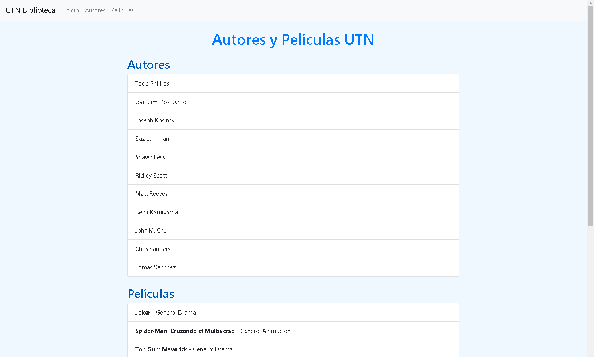
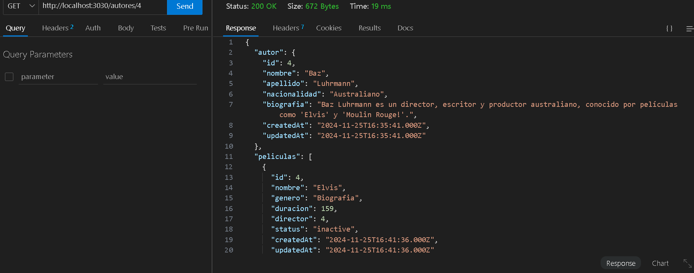
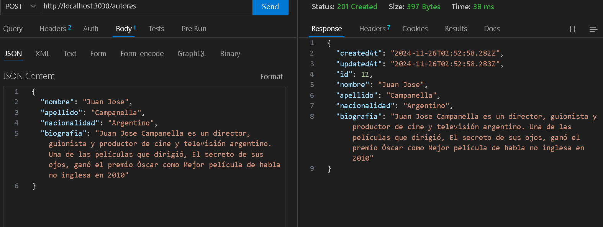
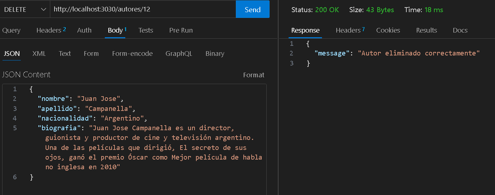

<br/>
<br/>

# Alumno: Cristian Jorge Valverde
# Materia: Programacion III
# Profesores: Gabriel Muñoz e Ibrahim Rodriguez
# Universidad Tecnologica Nacional (Avellaneda)

# Proyecto Directores y Peliculas

## Descripción

Este proyecto es una aplicación web para gestionar información sobre directores y películas. Utiliza Node.js, Express y Sequelize para interactuar con una base de datos MySQL. El front-end está estilizado con Bootstrap.

<br/>

## Instalación

Para instalar este proyecto, sigue estos pasos:

1. **Clonar el repositorio:**

   ```bash
   git clone https://github.com/valverdecristian/TP2-UTN-PIII-C331
   cd TP2-UTN-PIII-C331


2. **Instalar dependencias:**

   ```bash
   npm install


3. **Configurar la base de datos:**

   Utiliza el archivo `db.sql` para crear la base de datos y probarla con los datos iniciales.
   - Abre MySQL Workbench o tu herramienta preferida de gestion de base de datos.
   - Conectate a tu servidor MySQL
   - Ejecuta el contenido del archivo `db.sql` para crear la base de datos, las tablas y probarlas con los datos iniciales.


4. **Iniciar el servidor:**
   ```bash
   nodemon /app.js

<br/>

**Entrada del proyecto:**

El punto de entrada del proyecto es el archivo `app.js`. Aqui se configuran las dependencias, se define el puerto del servidor y se configuran las rutas.

<br/><br/>

**Estructura del proyecto:**

```
/views<br/>
    /partials<br/>
        head.ejs<br/>
        navbar.ejs<br/>
        script.ejs<br/>
    main.ejs<br/>
/controllers<br/>
    mainControllers.js<br/>
    autorController.js<br/>
    principalController.js<br/>
/models<br/>
    autor.js<br/>
    principal.js<br/>
/routes<br/>
    mainRouter.js<br/>
    autorRouter.js<br/>
    principalRouter.js<br/>
/data<br/>
    db.js<br/>
    autores.json<br/>
    peliculas.json<br/>
app.js<br/>
db.sql<br/>
```

<br/>

**Controladores:** <br/>
`controllers/mainControllers.js` : Este archivo contiene el controlador principal que maneja la lógica para renderizar la vista principal de la aplicacion. Utiliza Sequelize para interactuar con la base de datos y obtener los datos de los autores y peliculas en tiempo real.
<br/>

Descripción de la Funcion `index`: <br/>

Esta funcion es el punto de entrada para la ruta principal ('/'). Es una función asincronica que realiza consultas a la base de datos para obtener todos los registros de autores y peliculas. Luego renderiza la vista `main.ejs` con los datos obtenidos.
<br/>

Detalles:
<br/>

* Consultas a la base de datos: Utiliza `await autorModel.findAll()` y `await principalModel.findAll()` para obtener todos los registros de las tablas `autores` y `principales`.
* Renderizado de la vista: Utiliza `res.render` para renderizar la vista `main.ejs` y pasar los datos de autores y peliculas a la vista.
* Manejo de errores: Captura y registra cualquier error que ocurra durante las consultas a la base de datos, devolviendo una respuesta de error al cliente si es necesario.

`controllers/autorController.js` : Controla las operaciones relacionadas con los directores, como creación, lectura, actualización y eliminación.

<br/>
Funciones: <br/>
traerAutores: Obtiene todos los directores. <br/>
traerUnAutor: Obtiene un director específico por ID y sus películas. <br/>
crearAutor: Crea un nuevo director. <br/>
actualizarAutor: Actualiza la información de un director existente. <br/>
eliminarAutor: Elimina un director por ID. <br/>
<br/>

`controllers/principalController.js` : Controla las operaciones relacionadas con las películas, como creación, lectura, actualización y eliminación.

<br/>
Funciones: <br/>
traerPrincipales: Obtiene todas las películas. <br/>
traerUnPrincipal: Obtiene una película específica por ID. <br/>
crearPrincipal: Crea una nueva película. <br/>
actualizarPrincipal: Actualiza la información de una película existente. <br/>
eliminarPrincipal: Elimina una película por ID. <br/>
<br/>

**Rutas:**

`routes/mainRouter.js` : Define la ruta principal para renderizar la vista principal. <br/>
`routes/autorRouter.js` : Define las rutas para las operaciones CRUD relacionada con los directores. <br/>
`routes/principalRouter.js` : Define las rutas para las operaciones CRUD relacionada con las peliculas. <br/><br/>

**Vistas:**

Utilizamos EJS como motor de vistas para renderizar los datos. <br/>

`views/main.ejs` : Esta es la vista principal que muestra los directores y las peliculas.
Incluye archivos parciales que contienen partes reutilizables de las vistas. <br/><br/>

**Modelos:**

Los archivos en la carpeta `models` definen las estructuras de datos y las relaciones para interactuar con la base de datos mediante Sequelize.

`models/autor.js` : Define el modelo de datos para los autores. <br/>
`models/principal.js` : Define el modelo de datos para las peliculas (denominadas principales). <br/><br/><br/>

**VISTA PRINCIPAL:**

<br/><br/>

**Ejemplos de Endpoints y cómo probarlos:**

Endpoints de autores <br/>

- Obtener todos los autores:
- > URL: /autores
- > Método: GET
- > Descripción: Obtener una lista de todos los autores (directores) en la base de datos.
<br/>


<br/><br/>

- Obtener un autor por ID:
- > URL: /autores/:id
- > Método: GET
- > Descripción: Obtener la información de un autor especifico por ID, junto con sus peliculas.
<br/>


<br/><br/>

- Crear un nuevo autor:
- > URL: /autores
- > Método: POST
- > Descripción: Crear un nuevo autor en la base de datos.

<br/>


<br/><br/>

- Eliminar un nuevo autor:
- > URL: /autores/:id
- > Método: DELETE
- > Descripción: Elimina un autor especifico por ID.

<br/>


<br/>