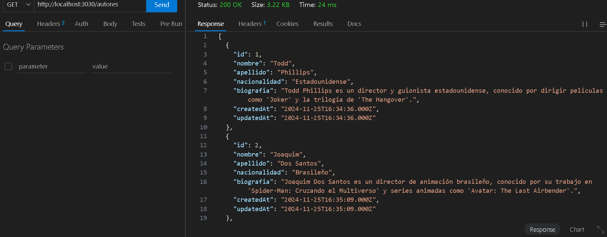

<br/>
<br/>

# Proyecto Directores y Peliculas

## Descripción

Este proyecto es una aplicación web para gestionar información sobre directores y películas. Utiliza Node.js, Express y Sequelize para interactuar con una base de datos MySQL. El front-end está estilizado con Bootstrap.

## Instalación

Para instalar este proyecto, sigue estos pasos:

1. **Clonar el repositorio:**

   ```bash
   git clone https://github.com/valverdecristian/TP2-UTN-PIII-C331
   cd TP2-UTN-PIII-C331

2. **Instalar dependencias:**

   ```bash
   npm install

3. **Configurar la base de datos:**

   En el archivo db.sql se encuentra los script que crea las tablas necesarias

4. **Iniciar el servidor:**
   ```bash
   nodemon /app.js

**Entrada del proyecto:**

El punto de entrada del proyecto es el archivo `app.js`. Aqui se configuran las dependencias, se define el puerto del servidor y se configuran las rutas.

**Estructura del proyecto:**

/views
    /partials
        head.ejs
        navbar.ejs
        script.ejs
    main.ejs
/controllers
    mainControllers.js
    autorController.js
    principalController.js
/models
    autor.js
    principal.js
/routes
    mainRouter.js
    autorRouter.js
    principalRouter.js
/data
    db.js
    autores.json
    peliculas.json
app.js
db.sql

**Controladores:**
`controllers/mainControllers.js` : Este archivo contiene el controlador principal que maneja la lógica para renderizar la vista principal de la aplicacion. Utiliza Sequelize para interactuar con la base de datos y obtener los datos de los autores y peliculas en tiempo real.

Descripción de la Funcion `index`:
Esta funcion es el punto de entrada para la ruta principal ('/'). Es una función asincronica que realiza consultas a la base de datos para obtener todos los registros de autores y peliculas. Luego renderiza la vista `main.ejs` con los datos obtenidos.
Detalles:
* Consultas a la base de datos: Utiliza `await autorModel.findAll()` y `await principalModel.findAll()` para obtener todos los registros de las tablas `autores` y `principales`
* Renderizado de la vista: Utiliza `res.render` para renderizar la vista `main.ejs` y pasar los datos de autores y peliculas a la vista.
* Manejo de errores: Captura y registra cualquier error que ocurra durante las consultas a la base de datos, devolviendo una respuesta de error al cliente si es necesario.

`controllers/autorController.js` : Controla las operaciones relacionadas con los directores, como creación, lectura, actualización y eliminación.

Funciones:
traerAutores: Obtiene todos los directores.
traerUnAutor: Obtiene un director específico por ID y sus películas.
crearAutor: Crea un nuevo director.
actualizarAutor: Actualiza la información de un director existente.
eliminarAutor: Elimina un director por ID.

`controllers/principalController.js` : Controla las operaciones relacionadas con las películas, como creación, lectura, actualización y eliminación.

Funciones:
traerPrincipales: Obtiene todas las películas.
traerUnPrincipal: Obtiene una película específica por ID.
crearPrincipal: Crea una nueva película.
actualizarPrincipal: Actualiza la información de una película existente.
eliminarPrincipal: Elimina una película por ID.

**Rutas:**

`routes/mainRouter.js` : Define la ruta principal para renderizar la vista principal.
`routes/autorRouter.js` : Define las rutas para las operaciones CRUD relacionada con los directores.
`routes/principalRouter.js` : Define las rutas para las operaciones CRUD relacionada con las peliculas.

**Vistas:**

Utilizamos EJS como motor de vistas para renderizar los datos.

`views/main.ejs` : Esta es la vista principal que muestra los directores y las peliculas.
Incluye archivos parciales que contienen partes reutilizables de las vistas.

**Modelos:**

Los archivos en la carpeta `models` definen las estructuras de datos y las relaciones para interactuar con la base de datos mediante Sequelize.

`models/autor.js` : Define el modelo de datos para los autores.
`models/principal.js` : Define el modelo de datos para las peliculas (denominadas principales).

**Ejemplos de Endpoints y cómo probarlos:**

- Endpoints de autores
- Obtener todos los autores
- > URL: /api/autores
- > Método: GET
- > Descripción: Obtener una lista de todos los autores (directores) en la base de datos.



